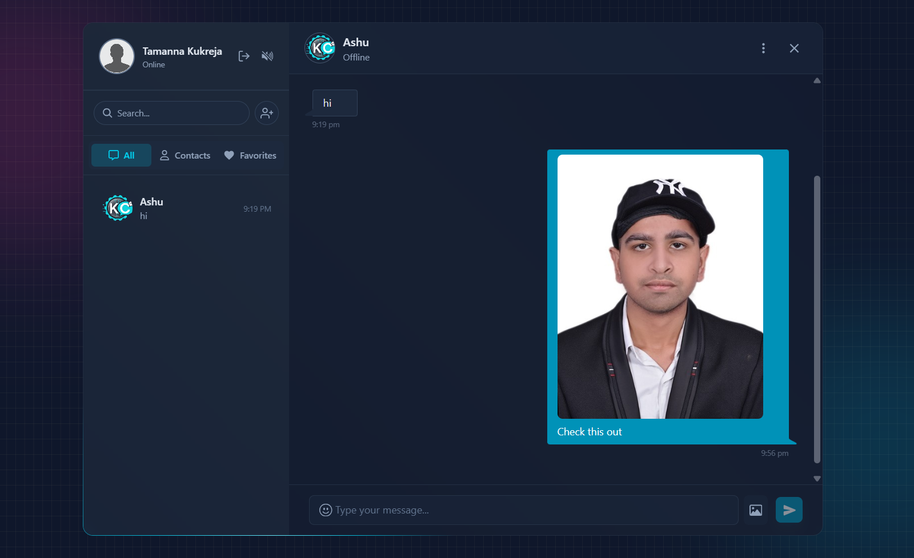

# KernelChat 💬

**KernelChat** is a modern, secure, and real-time messaging platform designed for seamless communication. Built with the MERN stack and Socket.io, it features end-to-end encryption, media sharing, and a sleek, responsive dark-mode UI.



## 🔗 Live Demo

Check out the live application here: **[View Live Demo](https://kernel-chat-six.vercel.app)**

---

## 🚀 Project Architecture

This project is organized as a monorepo with separate directories for the client and server.

### 📂 [Frontend](./frontend)
The client-side application built with **React + Vite**.
* **Features:** Real-time state management (Zustand), Optimistic UI updates, Dark Mode (Tailwind CSS).
* **[View Frontend Documentation](./frontend/README.md)** for installation and setup.

### 📂 [Backend](./backend)
The server-side API built with **Node.js, Express, and Socket.io**.
* **Features:** Secure authentication (JWT), At-rest message encryption, Cloudinary file uploads, and MongoDB aggregation pipelines.
* **[View Backend Documentation](./backend/README.md)** for environment setup and API details.

---

## ✨ Key Features at a Glance

* **⚡ Real-Time Messaging:** Instant delivery and "Online" status updates via Socket.io.
* **🔒 Secure:** Messages are encrypted at rest. Auth is handled via secure HTTP-only cookies.
* **📱 Responsive:** Fully optimized for desktop and mobile devices.
* **🖼️ Media Support:** Send and receive images seamlessly.
* **👥 Contact Management:** Add contacts, manage favorites, and block/unblock users.
* **🎨 Modern UI:** A clean, distraction-free dark theme with custom scrollbars and animations.

---

## 🛠️ Quick Start (Local Development)

To run the full stack locally, you need to run both the backend and frontend terminals.

**1. Clone the repository**
```bash
git clone https://github.com/Aayush6377/KernelChat.git
cd KernelChat
```

**2. Setup Backend**
```bash
cd backend
npm install
# Configure your .env file (see backend/README.md)
npm run dev
```

**3. Setup Frontend**
```bash
# Open a new terminal
cd frontend
npm install
# Configure your .env file (see frontend/README.md)
npm run dev
```

---

## 👨‍💻 Developer

**Aayush Kukreja**
* [GitHub](https://github.com/Aayush6377)
* [LinkedIn](https://www.linkedin.com/in/aayush-kukreja-b5885324a)
* [Portfolio](https://aayush-kukreja-portfolio.vercel.app)

